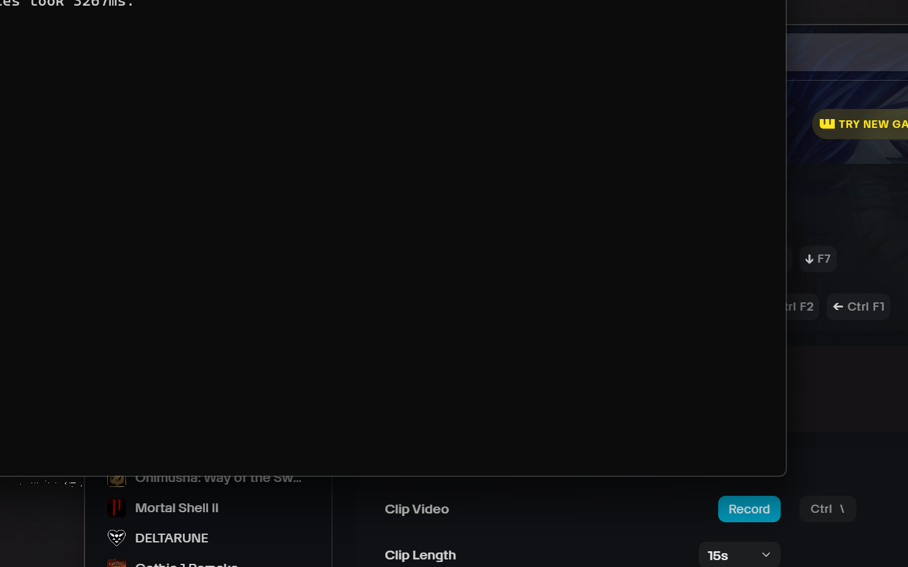
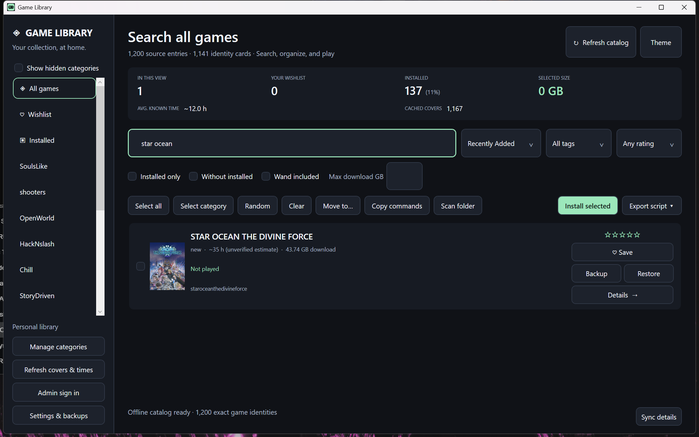

# Game Library Manager

A native Windows desktop app for managing a Docker-backed PC game library. It
keeps your catalog organized, downloads and installs games into their own
folders with live progress, tracks playtime, and launches titles directly or
through the WeMod / Wand trainer.



## Highlights

- **Durable installs with live progress.** Games download and extract into
  digest-scoped folders of your choosing. The terminal shows exact bytes and
  percentages for every step, resumes interrupted downloads automatically, and
  never leaves a finished download stranded.
- **Play with Wand.** One click opens the Wand trainer app, navigates to the
  game, and attaches its trainer. It works even while another game's trainer is
  already running.
- **Real metadata.** Artwork, completion hours, and disk requirements come from
  corroborated Steam, GOG, and HowLongToBeat records. Ambiguous titles and
  version-only tags are never mistaken for games.
- **Save awareness.** Backups are created and verified with checksums after a
  game exits; restores round-trip against the exact saved format and never
  touch unrelated files.
- **Fast.** The catalog is cached and the UI stays responsive while searching,
  filtering, and syncing.



## Install

Download the latest release from the
[Releases](https://github.com/Michaelunkai/game-library-manager-native/releases)
page:

- **`GameLibrary-windows-x64.zip`** — extract anywhere and run
  `GameLibrary.exe`. The bundle is self-contained: the .NET runtime, the WPF
  runtime DLLs, and the Wand bridge are included, so no separate install is
  needed.

On first launch the app creates a `data` folder next to the executable and
loads the bundled catalog. A few useful flags:

| Flag | Purpose |
|---|---|
| `--offline` | Start without network access |
| `--main-monitor` | Force the window onto the primary display |
| `--data-dir <path>` | Use a specific profile folder instead of `data` |

To install a game, open its card, choose **Install selected**, pick a library
folder, and the durable terminal walks through download, extraction, and
verification while you watch.

## Building from source

Requirements: [.NET 10 SDK](https://dotnet.microsoft.com/download/dotnet/10.0)
and Docker Desktop.

```powershell
cd native
.\build.ps1
```

`build.ps1` bundles the catalog from `public\` and publishes a self-contained
x64 package into `native\dist`. Run the verification suite against the exact
executable:

```powershell
powershell.exe -NoProfile -ExecutionPolicy Bypass `
  -File native\verify-reliability.ps1 `
  -ExePath native\dist\GameLibrary.exe -EvidenceRoot evidence\verification -Phase Target
```

## Project layout

```
native\       C# WPF source, build script, verification harness
public\       Catalog source bundled into the executable
launcher\     Compatibility launcher that forwards to the native build
docs\         Images and acceptance notes
dist\         Legacy launcher entry point (forwards to native\dist)
data\         Runtime profile: catalog cache, state, and install receipts
```

## Requirements

- Windows 10/11 x64
- Docker Desktop (for installing and extracting games)
- A Docker Hub namespace with game images, or a local catalog source

## Notes

- The self-test suite runs 150 checks covering identity, metadata, save
  backup/restore, durable installs, and Wand dispatch.
- Personal state lives in the local `data` profile; it is not part of the
  repository.
- See `docs\acceptance-current.md` for the acceptance audit and known gaps.