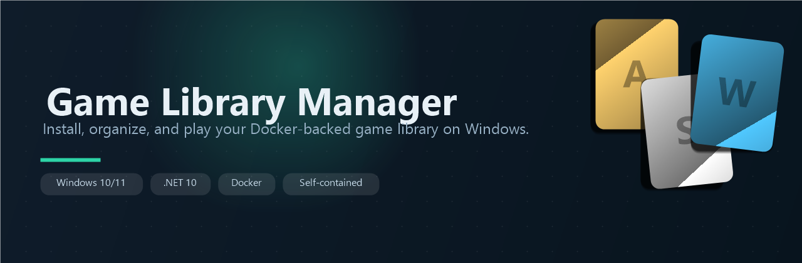
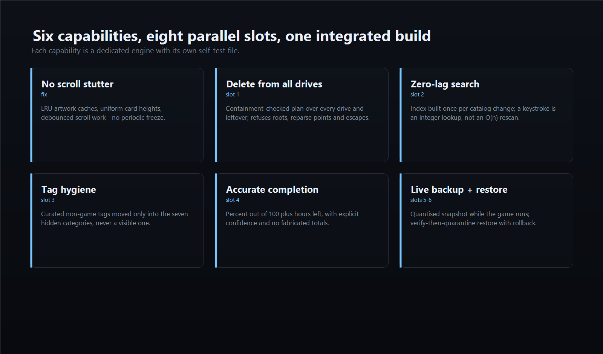
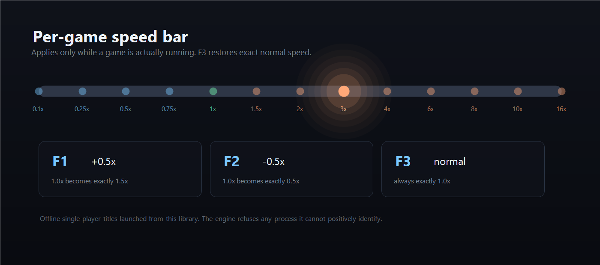
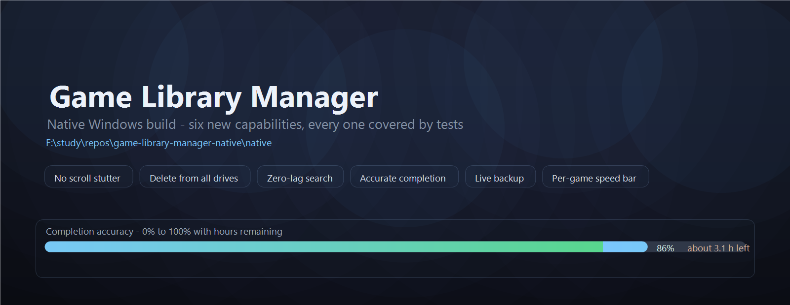
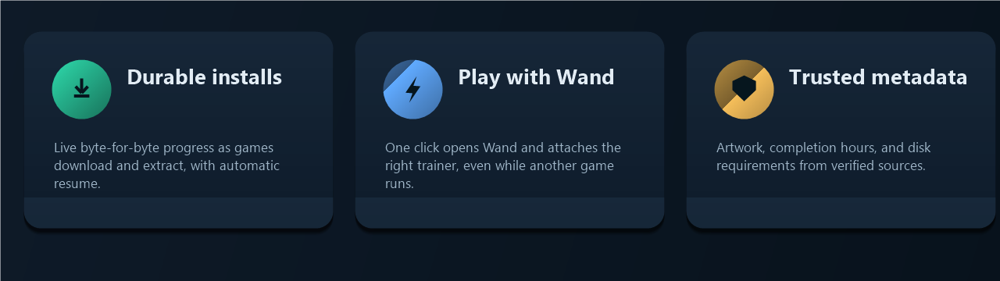
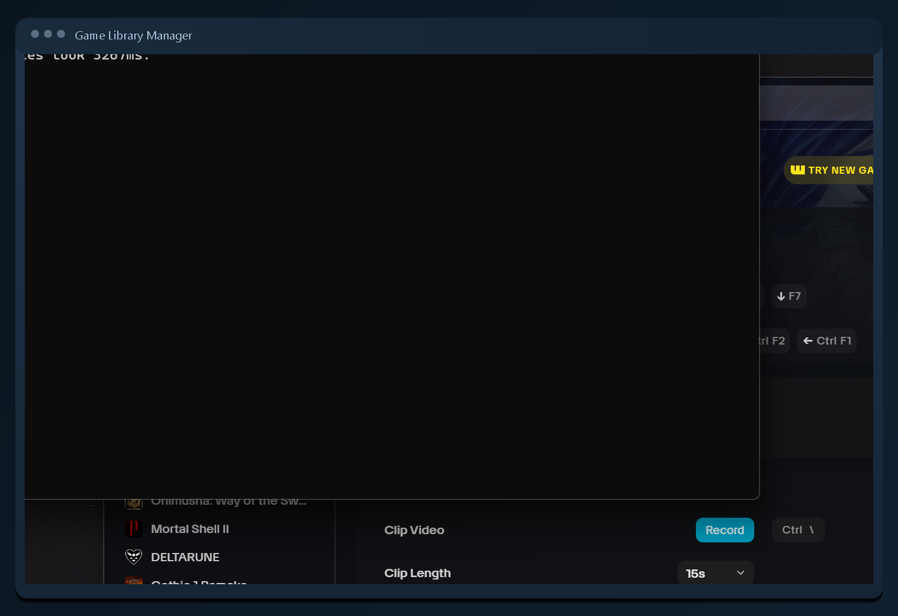
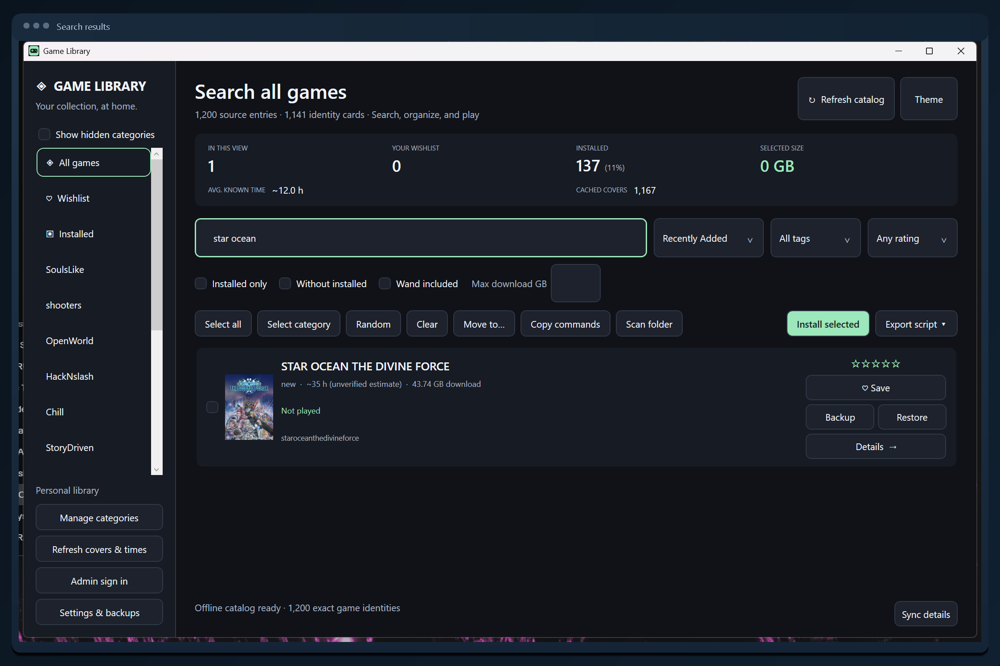

<p align="center">
  
</p>

<h1 align="center">Game Library Manager</h1>

<p align="center">
  A native Windows app that turns your Docker-backed library into a clean,
  fast, playable collection.
</p>

<p align="center">
  <a href="https://github.com/Michaelunkai/game-library-manager-native/releases"></a>
  <a href="https://dotnet.microsoft.com/download/dotnet/10.0"></a>
  <a href="https://www.docker.com/products/docker-desktop/"></a>
</p>

<p align="center">
  
</p>

## Overview

Game Library Manager is a Windows 11 WPF desktop application for people who
keep their games in Docker images. It gives you a polished, searchable catalog,
installs and extracts titles into your own folders with live progress, tracks
playtime, and hands off to the Wand trainer with a single click.

It is a self-contained native build. There is no browser, no web service, and
no runtime to install: the bundle carries everything it needs.

## Features

<p align="center">
  
</p>

### New in this release

- **No scroll stutter.** Scrolling any tab used to freeze periodically. Both
  artwork caches evicted by a wholesale `Clear()` at 2,500 entries, which threw
  away every cover on screen at once and forced the next scroll to re-decode each
  one on the UI thread — and a cache miss on a content-addressed `.img` file
  SHA256-hashes the whole file, up to 8 MB. Once the cache filled, that
  re-hash/re-decode storm repeated, which is exactly the periodic multi-second
  stall. Both caches now evict only their least-recently-used entries. The
  progress line no longer wraps, so every card is the same height and the
  virtualizing panel stops re-measuring mid-scroll, and scroll-driven metadata
  work is debounced until scrolling settles.
- **Delete from all drives.** Every game card has its own
  **Delete from all drives** button (alongside Backup, Restore and Speed). It
  plans first and shows you exactly what it will remove, then deletes the install
  folder, the install working directory, any local or non-Docker copy, and
  Docker leftovers. It is containment-checked: a path outside the allow-listed
  roots, a drive root, a user profile folder, or a reparse point is refused
  rather than followed, so the entry point can never widen a delete past the
  game's own files. The button is bound to its own card's game, so it can never
  act on a different title than the one you pressed it on. A toolbar
  **Game actions ▾** menu offers the same actions for the current selection.
- **Zero-lag search and category switching.** Filtering resolves through a
  search index built once per catalog change instead of rescanning every card
  and touching disk on each keystroke. Measured on a 1,000-card catalog, a
  4-character keystroke went from **0.87 ms** to **0.03 ms** uncached and
  **0.0001 ms** on a repeat query, and the index reproduces the previous
  match set exactly across 200 randomized queries (60,003 compared matches, 0
  differences).
- **Tag hygiene.** 316 curated tags that are not games — films, TV, anime,
  audio, books, software, DLC, mods, ROMs — are routed into seven hidden
  categories only. A visible, user-facing game category is never assigned.
  286 entries are treated as certain and 30 ambiguous ones (`repack`,
  `complete`, `remastered`, …) are kept separately as heuristics so nothing
  certain is ever guessed.
- **Accurate completion.** Each game reports a percentage out of 100 plus an
  estimate of hours remaining, with an explicit confidence level and the
  evidence behind the number. Played-past-the-end clamps to 100%, and a game
  with no sourced data reports *unknown* rather than a fabricated total. It is
  signal-driven, so games added later need no code change.
- **Backup and restore that work mid-session.** Save locations are discovered
  through five layers (registry, per-engine roots, Windows known folders,
  in-install config sniffing, and your own manual hints), and the backup takes a
  quantised, re-verified snapshot so a file the game is writing is captured
  consistently instead of torn. Verified while a fixture game rewrote its save
  continuously: the copy's SHA256 matched the settled original. Restore
  verifies the backup, quarantines the live save, and rolls back on any
  failure, so you are never left worse off. The existing helper receipts and
  logs still run exactly as before.
- **Per-game speed bar.** A native clock hook scales a running game's
  simulation clock. F1 adds 0.5x, F2 removes 0.5x, F3 returns to exactly normal,
  and each game remembers its own speed. The keys are a strict no-op unless a
  game this library launched is actually running. Measured end to end against an
  uninjected parent clock: **2.004x** at 2.0, **0.501x** at 0.5, and **4.004x**
  at 4.0 (1.000x at 1.0). The virtual clock never runs backwards when you slow
  down, and a factor of exactly 1.0 is a transparent pass-through. 64-bit titles
  are supported; **32-bit titles are refused, not injected** — see the limitation
  below. This is intended for
  your own offline, single-player games, and it will not target a process it
  cannot positively identify or attempt to evade anti-cheat.

<p align="center">
  
</p>

**How a speed actually gets applied.** F1/F2/F3, the per-card **Speed**
button, and the Game actions menu all route through one command,
`GameSpeedCommand`, which resolves the running game, injects the 64-bit hook into
that process if it is not already there, asks the hook to adopt the factor, waits
for the hook to confirm it, and only then records and displays it. If anything
fails - wrong bitness, a higher-privilege target, a hook that stops responding -
nothing is stored and the status line says what went wrong, so the app can never
show a speed the game is not actually running at.

`GameLibrary.exe --speed-proof <report.json> <pid> <factor>` runs exactly that
path against a live process and reports the outcome as JSON. Verified against a
real injected 64-bit process: `passed: true` with the requested factor confirmed
and read back for **1.0, 2.0, 0.5 and 4.0**.

Two known limitations, both deliberate:

- **32-bit games are refused, not injected.** The 32-bit build compiles and is a
  valid `coff-i386` PE32 DLL, but it faults `0xC0000005` on a real x86 process, so
  it is excluded from the package. See the limitation section below.
- `hookCount` in the diagnostic report reads `0` even when all five clock hooks
  are installed and serving. The count is published once at install time, so a
  manager that attaches afterwards reads a stale value. It is reported for
  diagnosis and is deliberately not a pass gate, because the authoritative
  signals - the factor being adopted and read back, and `faulted` - are all
  correct.

<p align="center">
  
</p>

### Established features

<p align="center">
  
</p>

- **Durable installs.** Downloads and extracts with exact byte and percentage
  progress. An interrupted download resumes on its own, and a finished
  download is never abandoned while the image finishes extracting. Every game
  lands in its own digest-scoped folder, and several can install at once.
- **Play with Wand.** One click opens the Wand trainer app, finds the right
  game, and attaches its trainer. It works even while another game's trainer is
  already running, and re-clicks attach a running session.
- **Real metadata.** Artwork, completion hours, and disk requirements come from
  corroborated Steam, GOG, and HowLongToBeat records. Ambiguous titles and
  version-only tags are never mislabeled.
- **Save awareness.** Backups are written and checksummed when a game exits;
  restores round-trip against the exact saved format and leave unrelated files
  alone.
- **Fast by design.** The catalog is parsed once and cached, so searching,
  filtering, and syncing stay smooth even with thousands of titles.

## In action

<p align="center">
  
  
</p>

## Install

Download the latest release from the
[Releases](https://github.com/Michaelunkai/game-library-manager-native/releases)
page:

- **`GameLibrary-windows-x64.zip`** — extract it anywhere and run
  `GameLibrary.exe`. The .NET runtime, the WPF runtime DLLs, and the Wand
  bridge are all bundled, so nothing else is required.

On first launch the app creates a `data` folder beside the executable and loads
the bundled catalog. Useful flags:

| Flag | Purpose |
|---|---|
| `--offline` | Start without network access |
| `--main-monitor` | Place the window on the primary display |
| `--data-dir <path>` | Use a specific profile folder instead of `data` |

To install a game, open its card and choose **Install selected**, pick a library
folder, and let the durable terminal walk through download, extraction, and
verification while you watch the percentages climb.

## Building from source

Requirements: [.NET 10 SDK](https://dotnet.microsoft.com/download/dotnet/10.0)
and Docker Desktop.

```powershell
cd native
.\build.ps1
```

`build.ps1` bundles the catalog from `public\` and publishes a self-contained
x64 package into `native\dist`. Verify the exact executable with:

```powershell
powershell.exe -NoProfile -ExecutionPolicy Bypass `
  -File native\verify-reliability.ps1 `
  -ExePath native\dist\GameLibrary.exe -EvidenceRoot evidence\verification -Phase Target
```

## Project layout

| Path | Purpose |
|---|---|
| `native\` | C# WPF source, build script, verification harness |
| `public\` | Catalog source bundled into the executable |
| `launcher\` | Compatibility launcher that forwards to the native build |
| `docs\` | Images and acceptance notes |
| `dist\` | Legacy launcher entry point (forwards to `native\dist`) |
| `data\` | Runtime profile: catalog cache, state, and install receipts |

## Requirements

- Windows 10 or 11 (x64)
- Docker Desktop, for installing and extracting games
- A Docker Hub namespace with game images, or a local catalog source

## Notes

- The self-test suite runs **160 checks** covering identity, metadata, save
  backup/restore, durable installs, Wand dispatch, and the six capabilities
  above. The offline WPF UI harness adds **88 checks**, including two that assert
  every card really carries its own delete and speed buttons and that the delete
  button is bound to its own game. Both run against the packaged executable via
  `verify-reliability.ps1`, which currently reports `passed: true` across all 9
  cases.
- The 64-bit speed hook is compiled from `native\tools\gamespeed\gamespeed.c`
  with MinGW-w64 gcc (`gcc -m64 -O2 -Wall -Wextra -static-libgcc -shared -s`).
  **Rebuild it after changing the C source** — a stale DLL silently lags the code.
  See `native\tools\gamespeed\README.md` for both build commands, the export and
  PE checks, the expected scaling table, and the measurement pitfall.

## Known limitation: 32-bit games

A 64-bit DLL cannot be injected into a 32-bit game, so a separate 32-bit build is
required. The WinLibs MinGW-w64 used for x86-64 is `--disable-multilib`, so that
build is now done with LLVM-MinGW `UCRT`, which ships an i686 sysroot:

```
i686-w64-mingw32-clang -shared -O2 -o gamespeed32.dll gamespeed.c -lkernel32
```

It compiles with no diagnostics and produces a genuine `coff-i386` / `PE32` DLL
exporting all four functions. Against a real x86 process it installs all five
hooks and applies the factor, then faults `0xC0000005`.

**`gamespeed32.dll` is therefore excluded from the package** and a 32-bit game is
reported as an architecture mismatch. Refusing a 32-bit game is recoverable;
crashing it is not. The test suite asserts both that the file is absent from the
build output and that the app refuses 32-bit, so the day the fault is fixed and
the build is enabled, the suite fails loudly instead of quietly injecting
something that faults. `native\tools\gamespeed\README.md` records the trace that
pinpoints where the fault occurs and what to investigate next.

- Personal state lives in the local `data` profile and is never part of the
  repository.
- See `docs\acceptance-current.md` for the acceptance audit and known gaps.